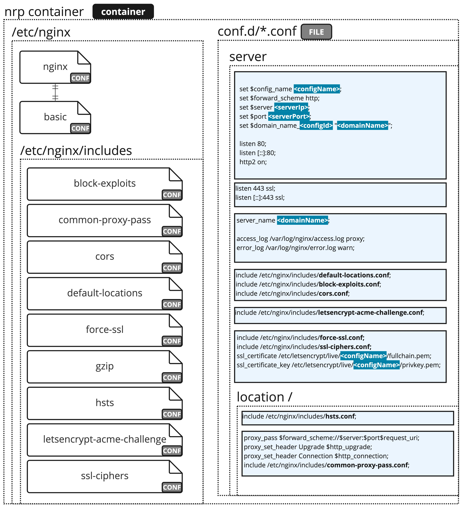
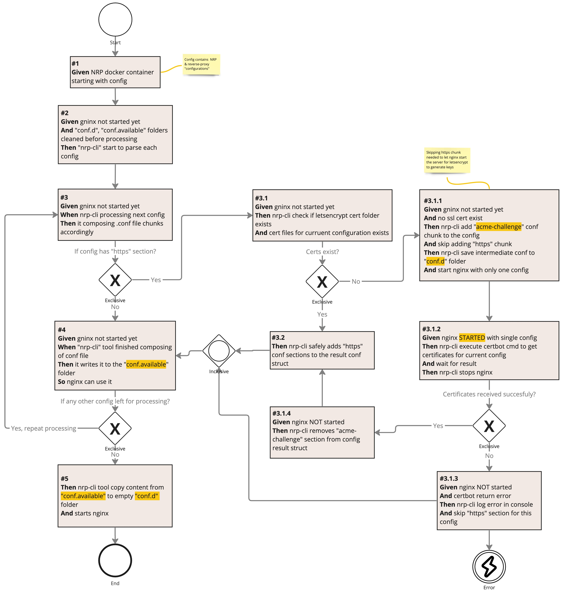

# nrp-cli

* [Basic usage](#basic-usage)
  * [Adding new service](#adding-new-service)
* [Configuration schema](#configuration-schema)
* [Command-line options](#command-line-options)
* [How to deploy manually](#how-to-deploy-manually)
* [Solution Design](#solution-design)
* [Troubleshooting](#troubleshooting)

[Nginx-Reverse-Proxy](https://github.com/oleksii-honchar/nginx-reverse-proxy) cli tool for creating `nginx` proxy-path configs with simple yaml configuration and HTTPS support.

## Basic usage

* Create empty `nrp.yaml` file and run `make run-all`. Go to `localhost` in browser. You should see `nginx-more` default page.

* Assume your services executed on the same host as nginx, and host has local IP = `192.168.0.12`. Also you had configured `service1.domain.tld` & `service1.domain.tld` redirect to your ISP public IP.

* Create `nrp.yaml` file in root repo folder:

  ```yaml
  schemaVersion: 0.3.0
  letsencrypt:
    email: "you-name@gmail.com"
    dryRun: false
  services:
  - name: service1
    serviceIp: 192.168.0.12
    servicePort: 9000
    domainName: service1.domain.tld
    cors: true
  - name: service2
    serviceIp: 192.168.0.12
    servicePort: 9100
    domainName: service2.domain.tld
    cors: true
    https: 
      use: true
      force: true 
      hsts: true
  ```

* If you don't have your ISP Nat-loopback enabled, then add localhost binding to `/etc/hosts` (suitable only for `nrp-cli` standalone use)

  ```text
  127.0.0.1 service2.domain.tld 
  ```

  ```bash
  make run-all
  ```

* `nrp-cli` will requests certificates for `service2` and then start nginx.
* If you are lucky, you will be able to request both of your services via domain name
* In case you don't have your ISP Nat-loopback enabled, you can reach them only by adding to `/etc/hosts`. This case covered in [nginx-reverse-proxy](https://github.com/oleksii-honchar/nginx-reverse-proxy) project as well as more complex services setup.
* It is not recommeneded to change `defaults.prod` values as they directly affect cli behaviour
* You can use `letsencrypt.dryRun = trye` option to verify that `certbot` is able to perform domain verification

### Adding new service

Just add new array item in `nrp.yaml`:

* Keep `name` unique
* `domainName` should contain only single domain, multiple domains not tested
* rest of the options will controls adding misc nginx includes to the service config
* if you don't need HTTPS omit `https` section

  ```yaml
  - name: service2
    serviceIp: 192.168.0.12
    servicePort: 9100
    domainName: service2.domain.tld
    domainRegistrant: route53 # optional, used only with "public-ip" global config section
    cors: yes # optional
    https: #optional, but highly recommended
      use: yes
      force: yes 
      hsts: yes
  ```
  
## Configuration schema

Most of the technical config predefined and hidden in "./pkg/config-defaults/nrp.defaults.*.yaml". Then it "right joined" to user config. So the user only need to define services to proxy to, in most of the cases.

Semantically bool flags, intentionally made with "yes|no" string values. Since it allows to merge properly user-defined and default values.

The `nrp.yaml` schema has following sections worth noting:

* `letsencrypt.dryRun` - [yes | no(default)] - make `certbot` use `--dry-run` option when set to "yes". Usefull for testing network setup if something goes wrong during certificates requests.
* `squid.use` - [yes(default) | no] - adding `squid` configs to create proxy on `squid.port` to be used by local network devices to access NRP services. Usefull when there is no ISP NAT-loopback available. Generally if one will not setup local network devices to use `squid` as proxy it will do nothing. Can be turned off by "no" value.
* `squid.useDnsmasq` - [yes(default) | no] - adding `dnsmasq` configs to be internal DNS service to resolve services domain names locally for `squid`.
* `dnsmasq.logs` - [yes | no(default)] - when set to "yes" enables dnsmasq logs.
* `services[].cors`- [yes | no] - should be set explicitly. When set to "yes", will include `cors` configuration to `nginx` server config. Check [nginx-config/templates/cors-servers.conf.tmpl](nginx-config/templates/cors-servers.conf.tmpl) for more details.
* `services[].domainRegistrant`- [route53] - should be set explicitly. Used in conjunction with `public-ip.scheduleCheckAndUpdate` section. Defines which CDK to use to update domain `A` record to point to your dynamic public IP.
* `services[].https.use`- [yes | no] - should be set explicitly. When set to "yes", will include HTTPS related templates to `nginx` server config. Check [./nginx-config/templates/service.conf.tmpl](nginx-config/templates/service.conf.tmpl) for more details.
* `services[].https.force`- [yes | no] - should be set explicitly. Forcing upgrade to HTTPS when HTTP request made.
* `services[].https.hsts`- [yes | no] - should be set explicitly. Check [wikipedia](https://en.wikipedia.org/wiki/HTTP_Strict_Transport_Security) for more details.
* `public-ip` - this section controls automatic update of your current public IP in `A` record of binded domains using `services[].domainRegistrant` value. That being said that in future releases it is possible to have domains with different registrants. This feature supposed to be used only if you don't have static public IP. Currently supported registrants are (by 6.10.23):
  * AWS Route 53
* `public-ip.scheduleCheckAndUpdate` - [yes | no] - should be set explicitly. When set to "yes" will schedule `cron` task to check and update (using registrant CDK) current public IP for corresponding domains.
* `public-ip.schedule` - [1min | 1h(default) | 1d | 1w | 1m] - should be set explicitly. Used when `public-ip.scheduleCheckAndUpdate` is set to "yes".

## Command-line options

* `-h, -help` - shows cmd help
* `-v, -version` - show build version
* `-log-level` - info(default)|error|warn|debug
* `-config` - path to `nrp.yaml` - './nrp.yaml'(default)
* `-defaults-mode` - dev|prod(default) with nginx & letsencrypt param wil be used. "Dev" used only for development
* `-certbot-wait` - debug only option, will make `nrp-cli` sleep for 5 min right before making certbot request

## How to deploy manually

* before commit/merge changes to `main`, bump `pkg/latest-version/latest-version.txt` version
* commit/merge changes to main
* create tag = `latest-version.txt`, e.g. `v0.3.0`
* `git push --tags`
* build binaries: `make build-n-compress-all` (they gitingored)
* make release for latest tag in github and attach `*.tar.gz` binaries
* update `Dockerfile` in [nginx-reverse-proxy](https://github.com/oleksii-honchar/nginx-reverse-proxy) to fetch new `nrp-cli` version

## Solution Design

Here is the nginx configuration decomposition in chunks from which then every service config composed:


Here is the nginx config generation flow diagram for main logic:


Rest of the configs generation pretty straightforward and can be found in the following templates:

* [crontab.tmpl](pkg/cron-config-processor/crontab.tmpl)
* [dnsmasq.conf.tmpl](pkg/dnsmasq-config-processor/dnsmasq.conf.tmpl)
* [squid.conf.tmpl](pkg/squid-config-processor/squid.conf.tmpl)
* [supervisord.conf.tmpl](pkg/supervisor-config-processor/supervisord.conf.tmpl)

## Troubleshooting

* When used without NRP, `nrp-cli` will fail when requesting SSL cert via Certbot. Domains need to be added to `/etc/hosts`.
* Explore `Makefile` targets to help you debug nginx & nrp-cli behaviour
